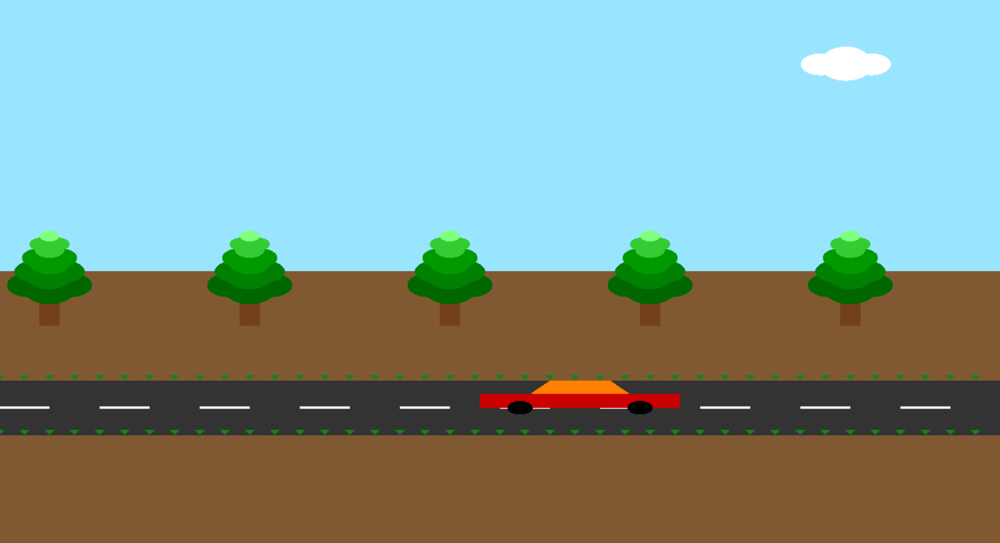
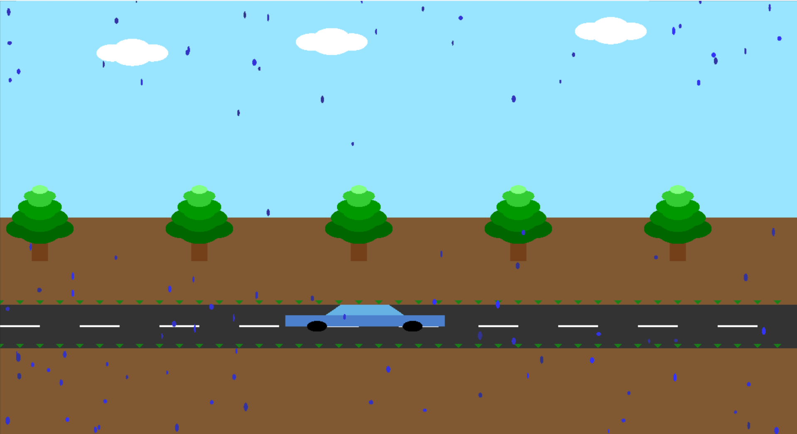

# OpenGL Car Animation 

This project is a dynamic 2D OpenGL animation simulating a car driving along a road. The scene features a vibrant environment including trees, clouds, roadside plants, and a toggling rain effect. The car continuously moves left-to-right or right-to-left, and the rain effect switches on and off periodically to create a more immersive animated scene.

## Features

1. Smooth car movement with rotating wheels.
2. Daylight sky with drifting clouds.
3. Multi-layered tree foliage for depth.
4. Randomly toggled rain animation with falling raindrops.
5. Small roadside plants for added detail.
6. Direction control and speed adjustment via keyboard.
7. Lightweight and runs using only core OpenGL and GLUT.

## Preview

### Sunny Weather with Trees and Clouds


### Rainy Weather with Animated Raindrops


## Controls

| Key | Action |
|-----|--------|
| `+` or `=` | Increase car speed |
| `-`         | Decrease car speed |
| `M` or `m`  | Move car to the right (forward) |
| `R` or `r`  | Move car to the left (reverse) |
| `ESC`       | Exit the application |

## Requirements

- C++ compiler (e.g., g++, MinGW, or clang++)
- OpenGL Utility Toolkit (GLUT) installed
- OpenGL development libraries

> On Windows, you can use [FreeGLUT](http://freeglut.sourceforge.net/) with MinGW or Visual Studio.  


##  How to Compile and Run

Make sure you have the required OpenGL and GLUT libraries installed before compiling the project.

---

### Windows (using MinGW + FreeGLUT)

1. **Install MinGW** with the `g++` compiler.
2. **Install FreeGLUT** development libraries and place `freeglut.dll` in the same folder as the executable, or in `C:\Windows\System32`.
3. Open **Command Prompt** and navigate to your project directory:
```bash
cd path\to\your\project
```
4. Compile the program using:
```bash
g++ main.cpp -o CarAnimation -lfreeglut -lopengl32 -lglu32
```
5. Run the executable:
```bash
CarAnimation.exe
```


